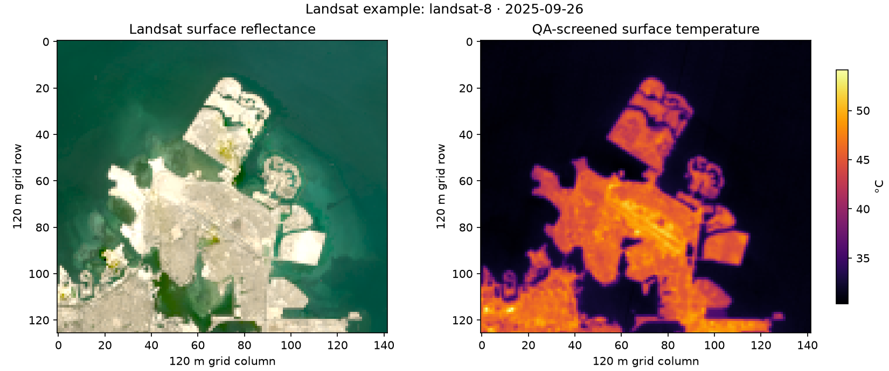
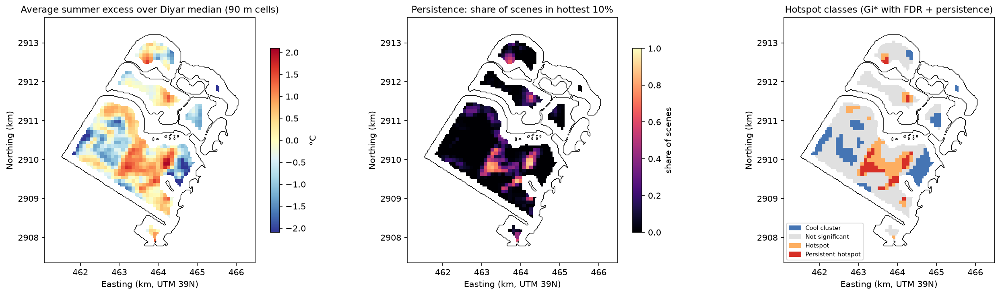
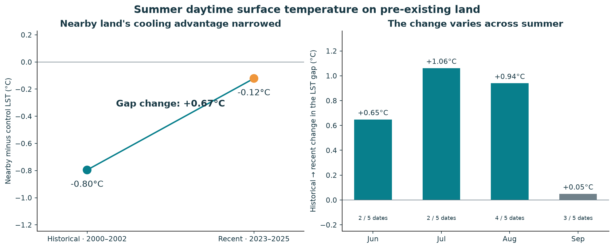
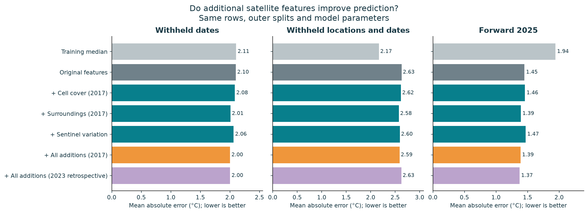

# Sidra — Satellite Evidence for Coastal Heat Planning

Team Sidra

Theme: Sustainable urban planning and smart cities  

Sidra uses satellite imagery to study summer surface heat on reclaimed land and nearby existing land. The two notebooks map persistent hotspots, compare historical and recent temperatures, and suggest an area for field inspection.

## Business use case


## Problem


## Data used

| Source | Observations used | Purpose and licence |
| --- | --- | --- |
| USGS Landsat Collection 2 Level-2, via Microsoft Planetary Computer (`landsat-c2-l2`) | Part 1: annual optical history for 1998–2025 and June–September temperatures for 1995–2006 and 2021–2025. Part 2: selected scenes from 2000–2014 and 2023–2025, plus historical candidates from 1995–2014. Tier 1 is used where specified in the code. | Land/water history, daytime surface temperature and optical indicators. [Public domain](https://www.usgs.gov/faqs/are-landsat-data-cloud-still-considered-be-within-public-domain). |
| Copernicus Sentinel-2 Level-2A, via Planetary Computer (`sentinel-2-l2a`) | Part 1: 12 summer 2025 scenes. Part 2: 20 scenes paired with recent Landsat dates in 2023–2025. Reflectance offsets and scene-classification masks are applied. | Vegetation, water, brightness and variation within each cell. [Copernicus Sentinel terms](https://dataspace.copernicus.eu/terms-and-conditions). |
| Impact Observatory / Microsoft / Esri annual 10 m land cover, version 02 (`io-lulc-annual-v02`) | Part 1: the 2023 map. Part 2: the 2017 and 2023 maps, with nine classes. | Built-area, bare-ground and vegetation shares. [CC BY 4.0](https://docs.impactobservatory.com/lulc-maps/maps-for-good.html). |
| Copernicus Climate Change Service / ECMWF ERA5 hourly reanalysis, via the public Earthmover mirror | Weather for selected observation dates in 1995–2014 and 2023–2025, on a 0.25° grid. Icechunk snapshot: `ZFKDHBCTBVHVXM3BQFV0`. | Regional air temperature, dew point, wind, radiation and rainfall in Part 2. [Mirror documentation and CC BY 4.0 attribution](https://registry.opendata.aws/earthmover-era5/). |

Part 1 records scene IDs, dates, settings and software versions in `outputs/hotspots/hotspot_metrics.json`. Part 2 lists the Landsat IDs, ordered historical candidates, Sentinel pairings and weather snapshot in its Setup section.

Inputs are cropped to the study area. Full scenes and download caches are excluded from the repository. The retrieval methods use public access and require no account credentials or API keys.

## Technical approach

Part 1: Reclaimed land

Annual median MNDWI, an optical water index, is used to identify water-to-land transitions on aligned 30 m Landsat and 10 m Sentinel grids in UTM zone 39N. The reclaimed pieces around Diyar's centre form a satellite-derived outline, which is checked against imagery.

For each summer temperature scene, we subtract the median temperature of open sea. We compare historical and recent observations at the same locations, then exclude the shoreline-gradient band before ranking inland heat. Temperature anomalies are aggregated to 90 m cells.

Hotspot clusters use Getis–Ord Gi* with a 135 m neighbourhood and Benjamini–Hochberg correction at 0.05. A persistent cell falls in the hottest 10% on at least half of its supported dates. Checks use neighbourhood radii of 90, 135 and 180 m and compare earlier and later summers. Sentinel vegetation and annual land-cover shares help describe each zone and suggest questions for a field visit.

Part 2: Surrounding land

Landsat quality masks are applied before aggregation to a 120 m grid, matching the older thermal sensor's native resolution. Each cell needs at least 80% clear samples and an ST_QA value no greater than 3 K.

Land/water histories define fixed nearby and control groups. We compare their median temperature gap between periods, giving each summer month equal weight. Checks change the controls, omit individual years, match measured surface histories, resample whole years and spatial blocks, and repeat the comparison on other coastal patches.

A histogram gradient-boosting model predicts recent control-land surface temperature from satellite indicators and regional weather. Validation withholds whole dates, buffered spatial blocks, both together, and all of 2025. Additional land-cover, 240/480 m neighbourhood and Sentinel-variation features are tested on the same complete observations.

The model uses `max_iter=180`, `max_leaf_nodes=15`, `learning_rate=0.07`, `min_samples_leaf=35`, `l2_regularization=5` and seed 42. Cells repeatedly warmer than predicted are shortlisted for inspection. Selection is checked across 13 model/control choices; consistency across those choices does not tell us how much cooling an intervention would achieve.

## Installation

Use Python 3.14 and the pinned dependencies in [requirements.txt](requirements.txt). The environment was tested on macOS. No GPU is needed.

```sh
git clone https://github.com/JosephYAA/sidra.git
cd sidra
python3.14 -m venv .venv
source .venv/bin/activate
python -m pip install -r requirements.txt
```

On Windows, create the environment with `py -3.14 -m venv .venv` and activate it with `.venv\Scripts\activate`. Windows execution has not been verified.

## How to run

From the repository root:

```sh
python -m jupyterlab notebooks
```

Open a notebook, select the installed environment, and choose Restart Kernel and Run All. Repeat for the other notebook.

To reproduce the pilot, keep the study settings and source selections as provided. If you change the bounds, dates or sensors, regenerate the affected cached inputs and repeat the data-quality and boundary checks.

A fresh run downloads several hundred megabytes of cropped inputs. Allow around ten minutes to download all the data, with more time on a slow connection. A checked run of Part 2 using cached inputs took about three minutes.

| Notebook | Generated files | Default output folder |
| --- | --- | --- |
| Part 1 | Maps, pixel table, GeoJSON zones, interactive HTML, figures and metrics | `outputs/hotspots/` |
| Part 2 | Figures, validation tables, source records, JSON summary and inspection cards | `outputs/surrounding_land/` |

These folders are ignored by Git. Both notebooks find the repository root when opened from `notebooks/`, so their results go to the root `outputs/` folder. Set `SIDRA_ROOT` to use a different root. Part 1 also saves its results archive as `outputs/hotspot_outputs.zip`.

To reuse a Part 2 cache, set `SIDRA_INPUT_CACHE` to its `data/expanded` directory. No environment variables are needed for a fresh run.

## Example input and output

[example_landsat.npz](data/sample_input/example_landsat.npz) contains a cropped Landsat 8 Collection 2 Level-2 observation from 26 September 2025, product `LC08_L2SP_163042_20250926_02_T1`. The file is about 0.48 MB and contains reflectance, surface temperature and quality arrays aggregated to Part 2's 120 m grid. [source.json](data/sample_input/source.json) records the assets, acquisition time, bounds, coordinate system, conversions, quality rules and checksum.

The preview shows natural-colour reflectance and surface temperature after quality screening:



This sample illustrates the input format. Each notebook retrieves the full set of observations needed for its analysis.

The figures below are saved outputs from the notebooks.







## Results and limitations

Model errors are reported as mean absolute error (MAE), in degrees Celsius. Lower values mean more accurate predictions.

| Comparison | Result | What it tells us |
| --- | --- | --- |
| Heat within the reclaimed development | About 11.4 km² of satellite-derived reclaimed area. Persistent inland hotspots cover about 34 ha; about 45 ha remain under the broader stability checks. | Places within Diyar to investigate, based on summer daytime observations. |
| Historical water-to-land change | Temperatures at Diyar's locations rose by about 14°C relative to open sea, compared with about 2.7°C on original land. | Different surface histories show different temperature changes. Sea-centering alone cannot establish causation. |
| Existing surrounding land | The nearby-minus-control gap increased by about 0.67°C. The whole-year/spatial-block interval is approximately −0.13 to +1.23°C. | The central estimate is positive, but the interval includes zero. |
| Additional satellite features | On the same observations, withheld-date MAE changes from about 2.10 to 2.00°C and forward-test MAE from 1.45 to 1.39°C. Spatial MAE changes from 0.88 to 0.91°C. | Predictive gains are modest and depend on the test. |
| Inspection shortlist | Seven 120 m cells form one area; five are consistently selected across model/control choices. | An area for a field visit. Local heat exposure and suitable interventions still need assessment. |

The underlying values are in the [reclaimed-land metrics](results/reclaimed_land_metrics.json), [surrounding-land summary](results/surrounding_land_summary.json) and [feature comparison table](results/satellite_feature_summary.csv). The notebooks report source selection, quality checks and sensitivity results. Resampling includes whole years and areas because observations from the same summer or location are related.

Landsat measures late-morning surface temperature. It does not directly measure air temperature or pedestrian heat stress. Its distributed 30 m products also do not provide independent 30 m thermal measurements: historical Landsat 5 thermal data have a native resolution of 120 m, while Part 1's 90 m hotspot grid is an aggregation choice. Near the shoreline, thermal footprints mix water and land.

Historical and recent sensors have not been harmonized, and subtracting sea temperature does not establish agreement between them. Control areas may have developed over time. Annual land-cover maps begin in 2017, NDBI responds to sand as well as buildings, and ERA5's regional air-temperature and wind estimates are too coarse to resolve differences between streets or local sea breezes.

These observational comparisons cannot isolate the effect of reclamation. Ground measurements, material checks and monitored interventions are needed to assess heat exposure and any cooling benefit.

## Team, licence and attribution

Landsat data are provided by USGS/NASA; Sentinel-2 by the European Union Copernicus programme and ESA; annual land cover by Impact Observatory, Microsoft and Esri; and ERA5 by Copernicus Climate Change Service/ECMWF, accessed through Earthmover. Microsoft Planetary Computer provides the satellite catalogue. The open-source packages used are listed in [requirements.txt](requirements.txt).

This study contains modified Copernicus Sentinel data and modified Copernicus Climate Change Service information for the observation years listed above. ERA5 subsets are converted locally to GRIB for verification; those files are not original CDS downloads. Data licence links are included in the Data table.
